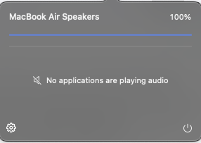
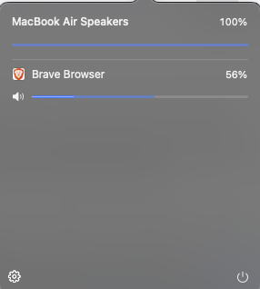

# Volumix

Volumix is a native per-application audio mixer for macOS. It lives in the menu bar and lets you
adjust volume, mute applications, monitor live audio levels, and route individual applications to
different output devices.

It provides the per-application controls familiar from the Windows volume mixer without installing
a virtual audio driver, kernel extension, or system extension.

<p>
  
  
</p>

## Features

- Automatically discovers applications that are currently producing audio.
- Provides independent volume and mute controls for each application.
- Displays a live level meter inside each volume control.
- Routes individual applications to available output devices.
- Restores saved gain, mute, and routing preferences.
- Opens from the menu bar or with the global `⌥⌘V` shortcut.
- Supports launch at login.

## Requirements

- macOS 14.4 or later.
- Apple Silicon or Intel Mac supported by macOS 14.4+.
- Swift 6.1 or later. Xcode Command Line Tools are sufficient.
- System Audio Recording permission on first launch.

## Quick start

```sh
git clone https://github.com/OWNER/Volumix.git
cd Volumix
make run
```

Grant System Audio Recording permission when macOS prompts. Volumix is a menu bar application, so
it intentionally has no Dock icon. Select the slider icon in the menu bar to open the mixer.

Common commands:

```sh
make run      # Build, package, sign locally, and launch.
make debug    # Run in the terminal with audio graph diagnostics.
make app      # Produce Volumix.app without launching it.
make stop     # Stop the running instance safely.
make spike    # Run the CoreAudio measurement tool.
make clean    # Remove local build artifacts.
```

For setup details, see [Building](docs/BUILDING.md). If the application does not appear or audio
permission behaves unexpectedly, see [Troubleshooting](docs/TROUBLESHOOTING.md).

## How it works

Volumix uses the CoreAudio Process Tap API available to third-party applications on macOS 14.4+.
Audio from each selected process is tapped with `.mutedWhenTapped`, mixed through a private
aggregate device, scaled in a real-time-safe IOProc, and written to the selected physical output.

Audio is processed in memory only. Volumix does not record, persist, or transmit audio.

Read [Architecture](ARCHITECTURE.md) for the signal path, lifecycle, and real-time constraints.

## Current status

The core mixer, live meters, persistent settings, global shortcut, launch at login, and
per-application output routing are implemented. Distribution packaging, notarization, and final
application artwork remain on the roadmap.

See [Roadmap](PLAN.md) for details.

## Known limitations

- Applications that open an audio device in exclusive mode may not be tappable.
- Process taps use stereo mixdown; multichannel and Atmos content is reduced to stereo.
- System alerts from `systemsoundserverd` and output owned directly by `coreaudiod` intentionally
  bypass Volumix and do not appear as separate applications.
- A force kill (`SIGKILL`) cannot run cleanup code. Normal exit, `SIGINT`, and `SIGTERM` are handled.

## Documentation

- [Architecture](ARCHITECTURE.md)
- [Design specification](DESIGN.md)
- [Roadmap](PLAN.md)
- [Building and development](docs/BUILDING.md)
- [Troubleshooting](docs/TROUBLESHOOTING.md)
- [Release process](docs/RELEASING.md)
- [Contributing](CONTRIBUTING.md)
- [Security policy](SECURITY.md)

## Contributing

Contributions are welcome. Audio code has strict real-time and cleanup requirements, so read
[CONTRIBUTING.md](CONTRIBUTING.md) and [AGENTS.md](AGENTS.md) before changing the audio path.

## License

Volumix is available under the [MIT License](LICENSE).
